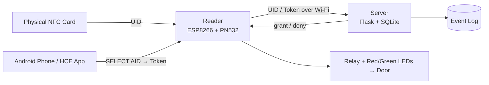
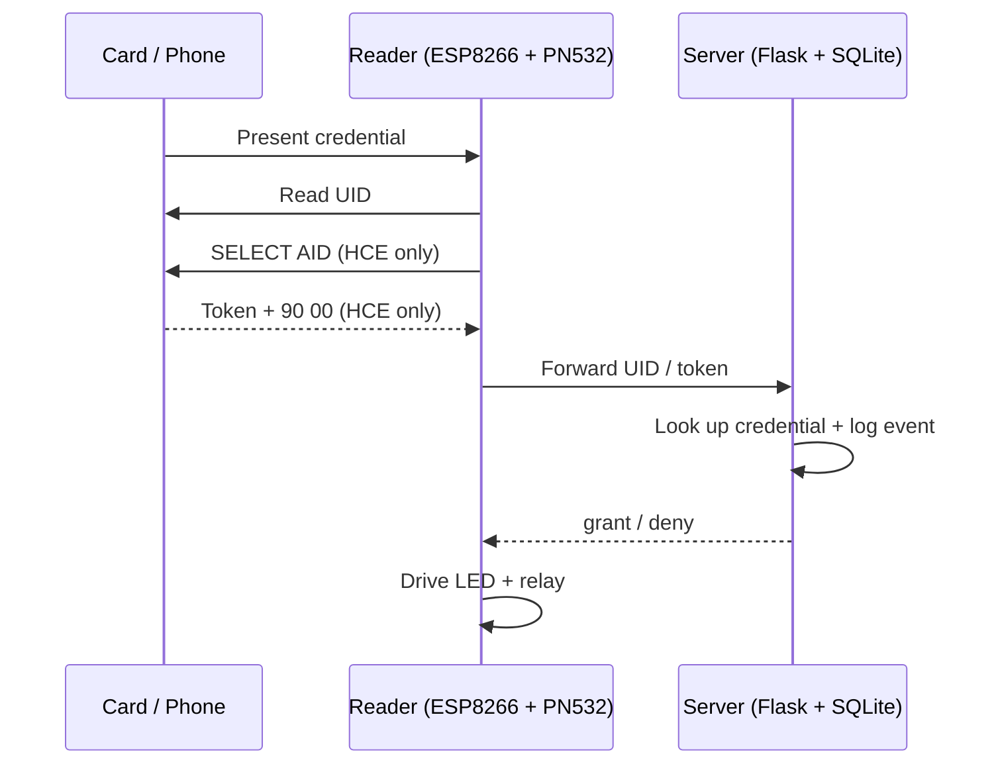

# RFID / NFC Access Control System

A card- and smartphone-based physical access control system built around a **PN532** NFC reader and an **ESP8266** microcontroller. Users authenticate with either a physical NFC card or an Android phone emulating a card over **Host Card Emulation (HCE)**. The reader forwards the credential to a **Flask + SQLite** backend, which owns the user list, makes the grant/deny decision, and logs every access event.

  
  
  
  
  

> Built as a proof of concept that follows real-world Physical Access Control System (PACS) design patterns.

---

## Features

- **Two credential types, one read path** — a physical card UID and an Android HCE token are read through the same PN532 flow.
- **Android HCE app** — a phone emulates a card using a custom applet (AID `F0010203040506`), with a deliberate "tap to show card" arming step.
- **Server-side decisions and audit log** — a Flask/SQLite backend resolves each tap against a credential-agnostic schema and records it.
- **Credential-agnostic design** — the schema stores a `credential_type`, so new credential kinds (HCE, a future iOS path, QR) slot in without a redesign.
- **Bench-testable** — a Python serial bridge stands in for the backend during hardware bring-up.

---

## Architecture

The prototype is a **two-tier** system: the reader queries the server on every tap, and the server decides live. Commercial PACS are typically **three-tier** (reader → local controller with a cached credential list → head-end server), which keeps working through a network outage. Moving toward that model — a local credential cache on the reader with periodic sync — is planned as a phase-2 improvement (see [Roadmap](#roadmap)).

### A single tap, end to end

**How the credential type is resolved:** after activating the target and reading its UID, the firmware attempts a `SELECT AID` APDU exchange on the still-activated target. If the exchange succeeds, the trailing `90 00` status word is stripped and the returned bytes are treated as an **HCE token**; if it fails, the reader falls back to the plain **card UID**. The server then normalizes whichever value it receives and looks it up the same way.

---

## Hardware

| Component | Selection / Notes |
|---|---|
| Reader MCU (current) | ESP8266 NodeMCU |
| NFC module | **PN532** (SPI) — required for the ISO 14443-4 / HCE exchange |
| Power | 3.7 V LiPo + 5 VDC converter |
| Charger (if battery) | TP4056 |
| Indicators | Red (deny) / green (grant) LEDs |
| Door actuator | Relay driving a fail-safe / fail-secure strike |
| Enclosure | 3D-printed case |

> **Why PN532 over MFRC522?** The cheaper MFRC522 reads static UIDs reliably but does not reliably support the ISO 14443-4 APDU exchange that Android HCE depends on. The PN532 does, so it carries the smartphone credential path.

### Wiring

**PN532 → ESP8266 (software SPI)**

| PN532 | ESP8266 |
|---|---|
| SCK | D7 |
| MISO | D6 |
| MOSI | D5 |
| SS / SDA | D1 |
| VCC | 3V3 |
| GND | GND |

---

## Components

### Reader firmware (ESP8266)

Written in C++ with **PlatformIO**, standardized on the **Adafruit_PN532** library over **software SPI** (`SCK=D7, MISO=D6, MOSI=D5, SS=D1`). A polling loop reads a passive ISO 14443A target, resolves it to a UID or HCE token (see above), and drives the LEDs/relay from the server's decision. After each read it explicitly releases the tag and waits for physical removal before re-arming, so the same tag isn't reported on every loop.

Two things worth knowing if you build on this:
- The Adafruit_PN532 software-SPI constructor order is `(clk, miso, mosi, ss)` — swapping MOSI/MISO fails silently.
- `setPassiveActivationRetries(1)` is too aggressive for HCE; the default blocking behavior gives the phone time to respond.

### Serial bridge (Python)

A bench tool that listens on the ESP8266's USB-serial port and acts as a stand-in decision source before the backend exists. It disables DTR/RTS to avoid the NodeMCU auto-reset, loads a UID whitelist from a text file, logs each read with a timestamp, and writes a `0`/`1` decision back over serial. It parses `UID value:` lines (a `TOKEN value:` branch for HCE credentials is on the roadmap).

### Backend (Flask + SQLite)

Owns the credential list and event log, and exposes a small HTTP interface the reader queries on each tap. Schema is credential-agnostic:

- **`users`** — one row per holder (id, name, active flag).
- **`credentials`** — one row per credential (owner id, `credential_type` such as `card_uid` or `hce_token`, value, enabled flag). A user may hold several.
- **`access_log`** — append-only audit trail (timestamp, presented credential, resolved user, outcome).

On a tap the server normalizes the value, confirms the credential and its owner are enabled, writes a log row, and returns a compact grant/deny response.

### Android HCE app

Java (`com.example.nfcidcard`), built on `HostApduService`, registering AID `F0010203040506`. When the PN532 issues a `SELECT AID`, Android routes the APDU to the service, which returns the credential bytes followed by `90 00`. A **one-shot arming** pattern (a "Show Card" button sets a flag that clears after one exchange) keeps the phone from silently answering every reader it passes. Note: the SELECT response must carry **non-empty identifier bytes** before the status word — a bare `90 00` yields an empty token. Validated on a Huawei P20 Lite (EMEA).

---

## Security considerations

- **Card UIDs can be cloned.** MIFARE Classic sector-key auth is better than a bare UID read, but Crypto1 is weak and vulnerable to nested-authentication attacks — where hardware is fixed, rotating tokens in sector data are the recommended mitigation.
- **Prefer a rotating/signed HCE token** over a static value so a captured exchange can't be replayed.
- **Keep it LAN-only** and add a shared-secret header between reader and server; the transport is currently plain HTTP over Wi-Fi and should move to TLS.
- **Choose door behavior explicitly** on power/network loss (fail-safe vs. fail-secure) — it's a safety decision, not a default.

---

## Roadmap

- [ ] Migrate the reader MCU from ESP8266 to **ESP32-C3 Mini** (`esp32-c3-devkitm-1`, likely `board_build.flash_size = 4MB`).
- [ ] **Local credential cache** on the reader (C++ struct array serialized to LittleFS) with periodic sync — moves toward the three-tier PACS model and enables offline decisions.
- [ ] Secure the reader-to-server transport with **TLS**.
- [ ] Add the `TOKEN value:` branch to the serial bridge.
- [ ] Revisit an **iOS** credential path as Apple CardSession entitlement/regional restrictions evolve.

---

## Platform support

| Platform | Method | Status |
|---|---|---|
| Physical card | ISO 14443A UID | ✅ Working |
| Android | HCE (`HostApduService`) | ✅ Working |
| iOS | CardSession (17.4+) / BLE | ⏳ Deferred — needs entitlements; EEA restrictions |

Android HCE lets an app emulate a card the reader reads through the exact same path as a physical card. iOS has no equivalent open API: CardSession needs organizational entitlements and carries EEA restrictions, and BLE is a weaker fallback (cold connections ~1–3 s vs. ~100–500 ms for an NFC tap). The credential-agnostic schema is what lets an iOS path be added later without touching the reader-to-server protocol.
