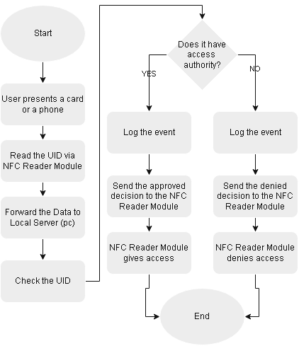

# RFID / NFC Access System — Design Document

> Design document for a card- and smartphone-based physical access control system.
> ESP8266 · PN532 · Android HCE · Flask / SQLite

## Contents

- [1. Project Overview](#1-project-overview)
- [2. Hardware Components](#2-hardware-components)
- [3. System Architecture](#3-system-architecture)
- [4. System Algorithm](#4-system-algorithm)
- [5. ESP8266 Firmware](#5-esp8266-firmware)
- [6. Serial Bridge Software](#6-serial-bridge-software)
- [7. Database](#7-database)
  - [7.1 Schema](#71-schema)
  - [7.2 Access Decision](#72-access-decision)
- [8. Android App](#8-android-app)
- [9. iOS Compatibility](#9-ios-compatibility)
- [10. Security Considerations](#10-security-considerations)
- [11. Roadmap / Future Work](#11-roadmap--future-work)

---

## 1. Project Overview

Building an ESP32-based security system that can authenticate a user either via a physical RFID/NFC card or via a smartphone app. User data is stored on a main server.

Workflow of the system:

- User presents a card or opens the app on the smartphone and taps **Show Card**, then presents the phone to the reader.
- The reader reads the UID/Token via the NFC module.
- The reader encrypts the data and forwards the UID/Token to the main server.
- The main server looks up the UID/Token in its database and returns an access decision.
- The ESP32 acts on the decision, and the main server logs the event.

The system uses the **HCE (Host Card Emulation)** protocol to communicate with the reader module. The Android platform supports HCE and lets third-party developers use it. Unfortunately, HCE is not available to third parties in the iOS development environment. In the current development stage, the BLE protocol is planned for the iOS platform rather than HCE, for more stable use cases.

## 2. Hardware Components

| Component | Recommended |
|---|---|
| Microcontroller | ESP8266 |
| NFC Module | PN532 |
| Battery / Converter Circuit | 3.7 V LiPo / 5 VDC converter |
| Charger Circuit (if a battery is used) | TP4056 |
| Indicator LEDs | Generic red and green LED |
| Control Relay | Generic relay |
| Protective Case | 3D-printed case |

## 3. System Architecture

A note on architecture tier: the design is a **two-tier** system — the ESP32 reader talks directly to the PC server on every tap, and the server makes the grant/deny decision live by querying SQLite. This is simple and fine for a prototype, but it differs from how commercial PACS are typically built. Production systems use a **three-tier** architecture: reader → local door controller (which holds a cached copy of the credential list and can make offline grant/deny decisions) → head-end server (which owns the source of truth and pushes updates down). The benefit is resilience — a commercial controller keeps working even if the network or head-end server goes down, whereas in this design a Wi-Fi or PC outage means every tap fails closed (or open, depending on fail-safe/fail-secure wiring). Introducing a local credential cache on the ESP32 with periodic sync from the PC server — deferred here as a "phase 2" improvement — would move this design closer to that three-tier model without requiring a redesign of the credential-agnostic schema already in place.

## 4. System Algorithm

The general system algorithm goes as follows:

- The user presents a card or a smartphone.
- The NFC reader module reads, encrypts, and forwards the UID/Token to the local server.
- The server checks the UID and decides if it has authority.
- The server logs the event, then sends the decision to the NFC reader module.
- The NFC reader module grants or denies access according to the decision of the local server.

  

## 5. ESP8266 Firmware

The prototype firmware runs a polling loop on the ESP8266 that continuously queries the PN532 reader over SPI for a passive ISO 14443A target. When a card or HCE-enabled device is detected, the firmware extracts the UID, prints it over Serial in hexadecimal form, and blocks briefly waiting for an access decision to be returned over the same connection. This decision — currently supplied by an external process rather than resolved on-device — drives a two-LED indicator (red/green) through a dedicated `actOnDecision()` routine, with an alternating blink pattern reserved for unrecognized decision values. After each successful read, the firmware explicitly releases the tag and polls until it is physically removed before re-arming detection; without this step, the PN532 continues re-reporting the same tag on every loop iteration, preventing a second card from ever being read. This UID-out/decision-in exchange over Serial is a deliberate simplification for the current live-query phase: it isolates the read/react hardware loop from the access-decision logic, so the eventual network client (HTTP request to the Flask backend) can be swapped in without changing how the firmware handles the reader or drives the LEDs.

## 6. Serial Bridge Software

To exercise the firmware's read/decision/LED cycle on the bench without a live backend, a Python script listens on the ESP8266's USB-serial connection and acts as a stand-in decision source. On startup, it disables DTR/RTS to avoid triggering the NodeMCU's auto-reset behavior, then loads a local whitelist of known UIDs from a text file into memory. For each `UID value:` line printed by the firmware, the script reconstructs the UID as a colon-separated hex string, appends a timestamped entry to a persistent log file, and checks the UID against the whitelist, writing the resulting 0/1 decision back to the firmware over Serial to drive the access LEDs. This script served two purposes during development: it validated the firmware's UID-reporting format end-to-end before any backend existed, and it doubled as the first hands-on exposure to file I/O and set-based lookups in Python. It is expected to be retired once the ESP8266 (or its ESP32-C3 successor) queries the Flask/SQLite backend directly, at which point the access decision moves from this local whitelist file to the `users` table.

## 7. Database

The backend is a Flask application backed by SQLite. It owns the authoritative credential list and the event log, and exposes a small HTTP interface that the reader queries on each tap. The schema is deliberately credential-agnostic so that new credential types (physical card, Android HCE token, and a future iOS credential) can be added without structural changes.

### 7.1 Schema

- **`users`** — one row per authorised holder: an internal id, display name, and active flag.
- **`credentials`** — one row per credential, storing the owning user id, a `credential_type` field (e.g. `card_uid` or `hce_token`), the credential value, and an enabled flag. A user may hold several credentials.
- **`access_log`** — an append-only audit trail: timestamp, the presented credential, the resolved user (if any), and the grant/deny outcome.

### 7.2 Access Decision

On each tap the reader sends the presented UID or token to the backend. The backend normalises the value, looks it up in the `credentials` table, confirms both the credential and its owning user are enabled, writes an `access_log` row, and returns a compact grant/deny response that the firmware maps to the LED and relay. Keeping the `credential_type` field in the lookup means the same endpoint serves card UIDs and HCE tokens without branching in the firmware.

## 8. Android App

The smartphone credential is an Android application (Java, package `com.example.nfcidcard`) built on `HostApduService`. It registers the application identifier (AID) `F0 01 02 03 04 05 06`; when the PN532 issues a SELECT-AID for this AID, Android routes the APDU to the service, which replies with the credential bytes followed by the `90 00` success status word.

Presentation uses a **one-shot arming** pattern: a button in the app sets an armed flag, and the flag clears after a single successful exchange, so a credential is only offered when the user deliberately taps "Show Card". This mirrors the tap-to-pay interaction model and avoids the phone silently answering every reader it passes.

One requirement is easy to miss: the SELECT response must carry **non-empty identifier bytes** before the status word. Returning a bare `90 00` is a valid APDU but yields an empty token on the reader side, so the applet must always prepend its identifier payload. The application was validated on a Huawei P20 Lite (EMEA variant), which is confirmed NFC/HCE-capable.

## 9. iOS Compatibility

A note on the iOS gap: unlike Android, where HCE lets a phone app emulate an NFC card that the PN532 reads using the exact same code path as a physical card, iOS has no equivalent open API. Apple's CardSession framework (iOS 17.4+) is the closest match, but it requires organizational developer entitlements to unlock and currently carries EEA regional restrictions — making it impractical to build against right now, though worth revisiting as those restrictions evolve. BLE looks like a natural fallback since the ESP32 already has it built in, but it doesn't offer the same reliability: cold BLE connections take roughly 1–3 seconds versus 100–500 ms for an NFC tap, and iOS throttles CBCentralManager background scanning, so a BLE credential can't be trusted to work the instant the user walks up the way a proper NFC tap can. In practice this means the iOS path isn't a drop-in replacement for HCE — it's a secondary credential type to be added later, which is exactly why the backend's credential-type field and credential-agnostic schema exist: iOS support can slot in as CardSession, BLE, or QR without touching the ESP32-to-server protocol or the database design.

Another experimental solution is to use the Apple Pay system and an EMV card assigned to it to grant access to the user. This approach would not be safe to use in an enterprise-level access control / security system but can be used for hobby purposes and applications that do not require high levels of security. A useful feature of the Apple Pay system is that the PAN of the EMV card gets mapped to a DPAN, and the mapping happens on Apple's servers — neither the device using Apple Pay nor the NFC reader can reach the actual PAN, which establishes information security for the user. The DPAN is stable per card-per-device, so it can be used as an identifier. Still, this approach does not make the system flexible enough to be used easily, because it requires a whole different identifier to work.

## 10. Security Considerations

- Physical card UIDs can be cloned. MIFARE Classic sector-key authentication is stronger than a bare UID read, but its Crypto1 cipher is weak and vulnerable to nested-authentication attacks; where the hardware is fixed, rotating tokens stored in sector data are the recommended mitigation.
- For Android, prefer a rotating or signed HCE token over a static value, so a captured exchange cannot be replayed.
- Keep the system LAN-only and add a shared-secret header between the reader and the server; the reader-to-server transport is currently plain HTTP over Wi-Fi and should be moved to TLS.
- Decide door behaviour on power or network loss explicitly (fail-safe vs. fail-secure) — it is a safety and security choice, not a default.

## 11. Roadmap / Future Work

- **Reader MCU migration** — move from the ESP8266 to an ESP32-C3 Mini (`esp32-c3-devkitm-1` board definition, likely needing a `board_build.flash_size = 4MB` override in PlatformIO).
- **Local credential cache ("phase 2")** — hold a cached credential list on the reader (a C++ struct array serialised to LittleFS), moving from a live server query per tap to offline-capable grant/deny decisions with periodic sync, bringing the design closer to the three-tier PACS model.
- **Transport security** — secure the reader-to-server link with TLS.
- **Serial bridge parser** — add the `TOKEN value:` branch so HCE credentials are handled on the bench path as well as card UIDs.
- **iOS credential** — revisit CardSession as entitlement/regional restrictions evolve; the schema already accommodates it without redesign.
